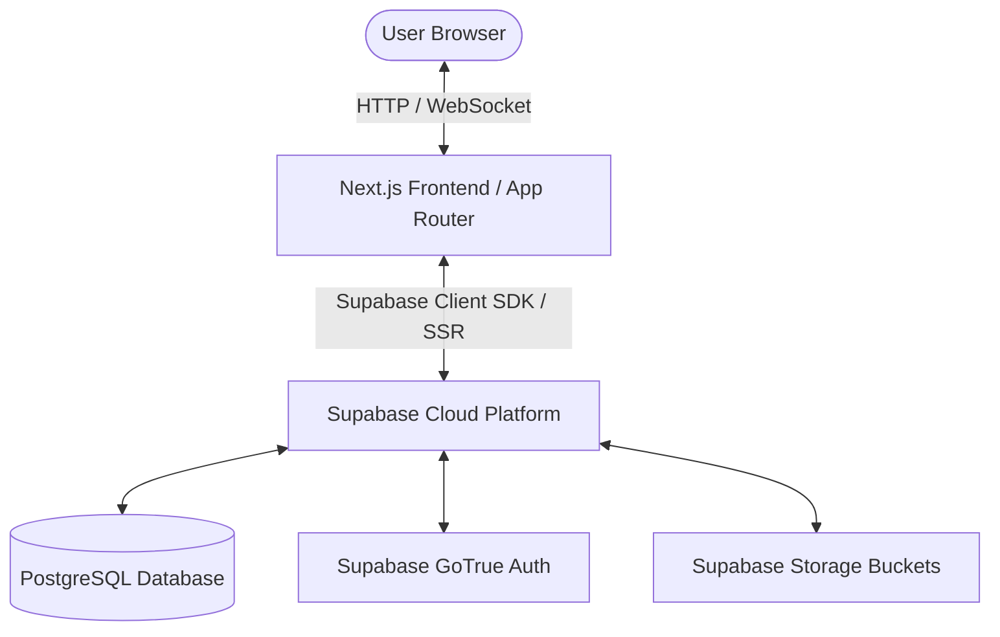
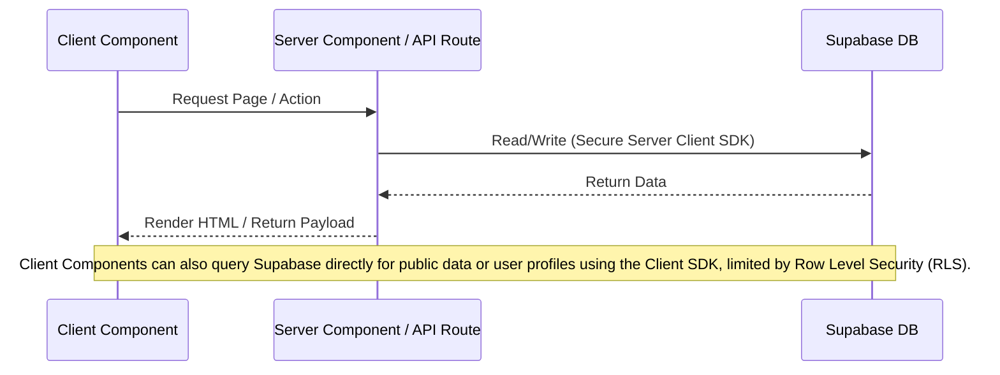

---
[AI] This document describes the system architecture of the EZPlay digital platform. It outlines the technology stack (Next.js 16, Supabase, TailwindCSS v4, shadcn/ui, sharp), folder organization (App Router, src/ directory), and explains how client-side and server-side components interact with Supabase client wrappers, storage buckets, and API routes.
[HUMAN] This document is the master map of how the application is built behind the scenes. It explains what technologies we used, where all the files are located, how images are processed, and how the different parts of the website talk to each other.
---

# Technical Architecture — EZPlay

## 1. System Overview

EZPlay is designed as a modern web application leveraging a serverless architecture.

*   **Frontend**: Next.js 16 with React 19, TypeScript, and TailwindCSS v4.
*   **Backend as a Service (BaaS)**: Supabase (handling Auth, PostgreSQL database, Storage, and Realtime communication).
*   **Image Processing**: Server-side image resizing and optimization is handled via the `sharp` library in Next.js Node.js API routes before files are stored.
*   **Deployment**: Vercel.

---

## 2. Technology Stack Justification

*   **Next.js 16 (App Router)**: Offers hybrid rendering (Server-Side Rendering, Static Site Generation, Client-Side Rendering), native performance optimization, and excellent developer experience with TypeScript.
*   **Supabase**: Eliminates the need for a separate custom Node.js backend. Provides native integration with PostgreSQL, built-in Authentication (Email + OAuth), secure Row Level Security (RLS) policies, and serverless triggers.
*   **TailwindCSS v4**: Next-generation CSS framework. Extremely fast compilation, built-in support for css variables, and native dark mode variants out-of-the-box.
*   **shadcn/ui**: Component library built on Radix UI and TailwindCSS. It generates components directly into the codebase (`components/ui`), allowing full customization and avoiding bulky npm dependency packages.
*   **sharp**: High-performance Node.js image processing library used to convert uploads into standardized WebP variants at multiple target resolutions for bandwidth efficiency.

---

## 3. Data Flow and Component Separation

Next.js App Router enforces a clean distinction between Server Components and Client Components:

### Server Components
*   Used for initial page rendering, dashboard statistics, metadata, cards browser loading, and database reads.
*   Instantiated using `await createClient()` from `@/lib/supabase/server`.
*   Directly read cookies to authenticate session tokens safely.

### Client Components
*   Used for interactive elements: forms (Login, Register), interactive motherboard chips, onboarding wizard slides, charts (Skill Radar Chart), toggles (language, theme), and the cards deck browser (filters, search, 3D flip card visual effects, admin editing modals).
*   Instantiated using `createClient()` from `@/lib/supabase/client`.
*   Marked with `"use client"` at the top of the file.

---

## 4. Key Directory Structure

*   `src/app/`: Contains the App Router routing structure mapped through logical Route Groups.
    *   `(platform)`: Core platform routes, including the cards browser (`/cards`) and global settings.
    *   `(ezplay)`: Dedicated space for the core game logic and future game environments.
    *   `(auth)`: Authorization pages (Login, Register).
    *   `api/`: API routes (`auth/callback` for OAuth, `cards/upload` for server-side `sharp` image scaling).
*   `src/components/`: Reusable components.
    *   `ui/`: Base components installed via shadcn/ui.
    *   `layout/`: Global layouts (Navbar, Sidebar, Theme/Language toggles).
    *   `landing/`, `auth/`, `profile/`, `admin/`: Component groups mapped to page features.
*   `src/lib/`: Custom business logic, helpers, and configurations.
    *   `supabase/`: DB Clients (`client.ts`, `server.ts`) and database Types (`types.ts`).
    *   `i18n/`: Internationalization setups (`config.ts`, `get-dictionary.ts`) and dictionaries (`ro.json`, `en.json`).

---

## 5. UI & Presentation Logic (Cards Engine)

The rendering engine for cards (e.g., `CardsClient.tsx`) utilizes strict frontend separation of concerns:
*   **Format Layouts**: Differentiates between `portrait` and `landscape` cards via Tailwind `aspect-ratio` (`aspect-[3/4]` vs `w-[220px] aspect-[220/150]`).
*   **State configuration**: Uses external constant objects (`STACK_CONFIG`) to act as a single source of truth for UI colors, gradients, and icons, avoiding logic clutter in the components.
*   **Animations**: Complex CSS animations (`@keyframes shuffle`, `card-fade-in`) are offloaded to `globals.css` instead of inline styles, ensuring they are globally reusable across the platform (e.g., between the Deck Browser and actual Game pages).
