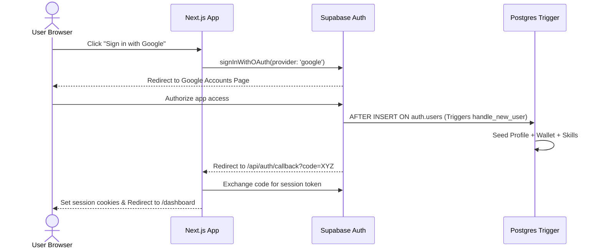
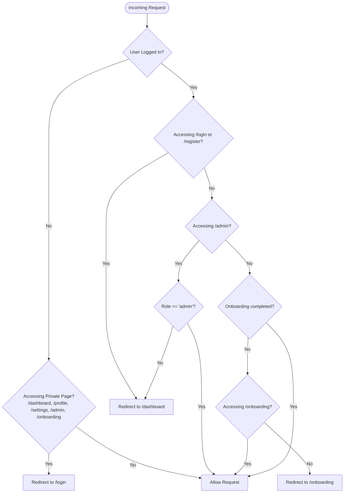

---
[AI] This document specifies the authentication architecture for EZPlay. It details the Email/Password signup, Google OAuth flow, Next.js Middleware route guarding, the OAuth callback handler API route, and the post-login onboarding check that enforces redirection to /onboarding until completed.
[HUMAN] This document explains how registration and login work (both with email and with Google). It also describes the safety rules that check if a user is logged in, and how new users are automatically guided to the profile setup wizard.
---

# Authentication Flows — EZPlay

## 1. Sign-Up & Sign-In Flows

EZPlay supports two secure authentication methods managed by Supabase GoTrue:
1.  **Email & Password** (Self-managed registration).
2.  **Google OAuth** (Third-party single sign-on).

---

## 2. Next.js Routing Protection (Middleware)

The file `middleware.ts` acts as the gateway for all HTTP requests, enforcing session checks and role rules:

---

## 3. Google OAuth Setup Instructions

For Google Login to function, Google Cloud and Supabase must be linked:

### Step 1: Create Google Cloud Project Credentials
1.  Go to the [Google Cloud Console](https://console.cloud.google.com/).
2.  Create a new project named `ezplay`.
3.  Set up the **OAuth consent screen** (External, user support email, and developer email).
4.  Go to **Credentials** -> **Create Credentials** -> **OAuth client ID**.
5.  Application type: **Web application**.
6.  Authorized redirect URIs:
    `https://[YOUR_SUPABASE_PROJECT_ID].supabase.co/auth/v1/callback`

### Step 2: Configure Supabase Dashboard
1.  Go to the [Supabase Dashboard](https://supabase.com/dashboard).
2.  Navigate to **Authentication** -> **Providers** -> **Google**.
3.  Turn ON the Google provider.
4.  Copy the **Client ID** and **Client Secret** generated in Google Cloud Console.
5.  Save settings.

---

## 4. 3-Step Onboarding Flow

Once logged in, if `user_profiles.onboarding_completed` is `false`, the middleware restricts all navigation to `/onboarding`.

*   **Step 1: Personal Info**
    *   Fields: Display Name (defaults to email name prefix) and a short biography.
*   **Step 2: Skill Interests**
    *   Select interest tags mapped to the 5 perspective areas (Market, Product, Operations, Finance, Strategy).
*   **Step 3: Avatar Setup**
    *   Upload profile image (stores in Supabase Storage bucket `avatars/`) or select to use automatically generated initials.
    *   Clicking "Finish Setup" triggers an API call updating `onboarding_completed = true` and redirects to `/dashboard`.
