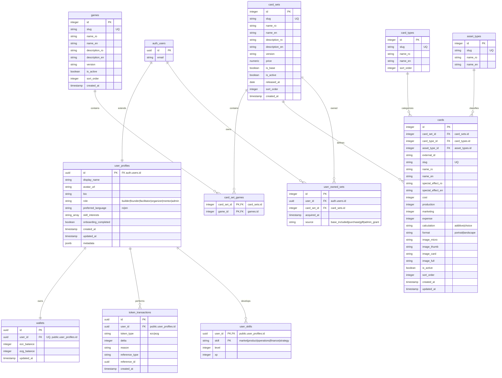

---
[AI] This document details the database schema implemented in Supabase (PostgreSQL). It lists all tables, columns, data types, foreign keys, triggers (such as handling new auth.users insertion, updating updated_at timestamp, and automatically granting base card sets on user profile creation), and Row Level Security (RLS) policies.
[HUMAN] This document describes how the database is structured. It shows where we save user profiles, their token balances, transaction history, skill progress, and the cards system data (games, sets, cards, owned sets), including the safety rules that prevent users from seeing each other's private data or bypassing game rules.
---

# Database Schema & Security — EZPlay

## 1. Relational Diagram

Here is how the database tables are structured and linked:



---

## 2. Table Schemas

### `public.user_profiles`
Extends the core Supabase authentication table `auth.users`. Holds profile metadata.

*   `id` (UUID, Primary Key): References `auth.users(id)` with cascade deletion.
*   `display_name` (TEXT, NOT NULL): The nickname shown in the app.
*   `avatar_url` (TEXT): Link to profile image (either gravatar, initials, or Supabase Storage file).
*   `bio` (TEXT): A short personal description.
*   `role` (TEXT, NOT NULL, DEFAULT 'builder'): Restrained by CHECK constraints to: `builder`, `founder`, `facilitator`, `organizer`, `mentor`, `admin`.
*   `preferred_language` (TEXT, DEFAULT 'ro'): Restrained to `ro`, `en`.
*   `skill_interests` (TEXT[], DEFAULT '{}'): List of perspectives selected during onboarding.
*   `onboarding_completed` (BOOLEAN, DEFAULT FALSE): Flag to control onboarding wizard redirection.
*   `created_at` / `updated_at` (TIMESTAMPTZ, DEFAULT NOW()).
*   `metadata` (JSONB, DEFAULT '{}'): Catch-all for extra settings.

### `public.wallets`
Tracks virtual game token balances (Coins - EZC, Gems - EZG).

*   `id` (UUID, Primary Key): Autogenerated.
*   `user_id` (UUID, Unique, NOT NULL): References `public.user_profiles(id)` with cascade deletion.
*   `ezc_balance` (INTEGER, DEFAULT 0, >= 0): Coins balance.
*   `ezg_balance` (INTEGER, DEFAULT 0, >= 0): Gems balance.
*   `updated_at` (TIMESTAMPTZ, DEFAULT NOW()).

### `public.token_transactions`
Ledger of token updates. Essential for data auditability.

*   `id` (UUID, Primary Key): Autogenerated.
*   `user_id` (UUID, NOT NULL): References `public.user_profiles(id)`.
*   `token_type` (TEXT, NOT NULL): `ezc` or `ezg`.
*   `delta` (INTEGER, NOT NULL): Positive or negative token change.
*   `reason` (TEXT, NOT NULL): Description of the transaction.
*   `reference_type` (TEXT): Type of linked resource (e.g., 'session', 'challenge').
*   `reference_id` (UUID): ID of the linked resource.
*   `created_at` (TIMESTAMPTZ, DEFAULT NOW()).

### `public.user_skills`
Tracks experience (XP) and level progress on the 5 entrepreneurship perspectives.

*   `user_id` (UUID, Primary Key): References `public.user_profiles(id)`.
*   `skill` (TEXT, Primary Key): `market`, `product`, `operations`, `finance`, or `strategy`.
*   `level` (INTEGER, DEFAULT 1, >= 1): Level of competence.
*   `xp` (INTEGER, DEFAULT 0, >= 0): Cumulative experience points.

---

### `public.games`
List of games on the EZPlay platform.
*   `id` (SERIAL, Primary Key): Autoincremented identifier.
*   `slug` (TEXT, Unique, NOT NULL): URL-safe name (e.g., `'ezplay-1'`).
*   `name_ro` / `name_en` (TEXT, NOT NULL): Bilingual display name.
*   `description_ro` / `description_en` (TEXT): Bilingual description.
*   `version` (TEXT, DEFAULT '1.0'): Current game version.
*   `is_active` (BOOLEAN, DEFAULT TRUE): Flag to toggle game visibility.
*   `sort_order` (INTEGER, DEFAULT 0): Used for manual listing orders.
*   `created_at` (TIMESTAMPTZ, DEFAULT NOW()).

### `public.card_sets`
Represents card decks/packs (e.g., base deck, expansions).
*   `id` (SERIAL, Primary Key): Autoincremented identifier.
*   `slug` (TEXT, Unique, NOT NULL): URL-safe name (e.g., `'base-game'`).
*   `name_ro` / `name_en` (TEXT, NOT NULL): Bilingual display name.
*   `description_ro` / `description_en` (TEXT): Bilingual description.
*   `version` (TEXT, DEFAULT '1.0'): Version of the set.
*   `price` (NUMERIC(10,2)): Sale price (NULL = free or included by default).
*   `is_base` (BOOLEAN, DEFAULT FALSE): If TRUE, granted automatically to new users upon profile creation.
*   `is_active` (BOOLEAN, DEFAULT TRUE): Flag to toggle set visibility.
*   `released_at` (DATE): Release date of the set.
*   `sort_order` (INTEGER, DEFAULT 0): Order of rendering.
*   `created_at` (TIMESTAMPTZ, DEFAULT NOW()).

### `public.card_set_games`
Many-to-many relationship mapping card sets to one or multiple games.
*   `card_set_id` (INTEGER, Foreign Key): References `card_sets(id)` with cascade deletion.
*   `game_id` (INTEGER, Foreign Key): References `games(id)` with cascade deletion.
*   *Composite Primary Key*: `(card_set_id, game_id)`.

### `public.card_types`
The structural type of a card (e.g., standard, event, entrepreneur).
*   `id` (SERIAL, Primary Key).
*   `slug` (TEXT, Unique, NOT NULL): URL-safe name (e.g., `'standard'`).
*   `name_ro` / `name_en` (TEXT, NOT NULL): Bilingual name.
*   `sort_order` (INTEGER, DEFAULT 0).

### `public.asset_types`
Classification of cards by entrepreneurship perspectives or actions.
*   `id` (SERIAL, Primary Key).
*   `slug` (TEXT, Unique, NOT NULL): (e.g., `'tangible-assets'`, `'human-resources'`).
*   `name_ro` / `name_en` (TEXT, NOT NULL): Bilingual name.

### `public.cards`
The master catalog of all gameplay cards.
*   `id` (SERIAL, Primary Key).
*   `card_set_id` (INTEGER, Foreign Key): References `card_sets(id)`.
*   `card_type_id` (INTEGER, Foreign Key): References `card_types(id)`.
*   `asset_type_id` (INTEGER, Foreign Key): References `asset_types(id)`.
*   `external_id` (TEXT, NOT NULL): CSV original identifier (e.g. `'101'`).
*   `slug` (TEXT, Unique, NOT NULL): Unique card identifier (e.g. `'s101'`, `'e101'`).
*   `name_ro` / `name_en` (TEXT, NOT NULL): Bilingual title.
*   `special_effect_ro` / `special_effect_en` (TEXT): Bilingual description of the card effects.
*   `cost` (INTEGER): Acquisition cost.
*   `production` (INTEGER): Production point value.
*   `marketing` (INTEGER): Marketing point value.
*   `expense` (INTEGER): Turn-based maintenance cost.
*   `calculation` (TEXT): Check constraint `in ('additive', 'choice')`.
*   `format` (TEXT): Check constraint `in ('portrait', 'landscape')`.
*   `image_micro` (TEXT): Path in `cards` bucket for micro variant (80px width).
*   `image_thumb` (TEXT): Path in `cards` bucket for thumbnail variant (150px width).
*   `image_card` (TEXT): Path in `cards` bucket for regular card variant (400px width).
*   `image_full` (TEXT): Path in `cards` bucket for original/fullsize WebP image.
*   `is_active` (BOOLEAN, DEFAULT TRUE): Toggle card active state.
*   `sort_order` (INTEGER, DEFAULT 0).
*   `created_at` / `updated_at` (TIMESTAMPTZ, DEFAULT NOW()).

### `public.user_owned_sets`
Keeps track of which card sets are unlocked/owned by each user.
*   `id` (SERIAL, Primary Key).
*   `user_id` (UUID, Foreign Key): References `auth.users(id)` with cascade deletion.
*   `card_set_id` (INTEGER, Foreign Key): References `card_sets(id)`.
*   `acquired_at` (TIMESTAMPTZ, DEFAULT NOW()).
*   `source` (TEXT): Check constraint `in ('base_included', 'purchase', 'gift', 'admin_grant')`.
*   *Composite Unique Constraint*: `(user_id, card_set_id)`.

---

## 3. Automated Triggers & Functions

### `public.handle_new_user()`
Runs automatically whenever a row is inserted into `auth.users` (sign-up).
1.  Extracts user meta data (such as Google OAuth avatar and name) or falls back to email prefix.
2.  Creates a matching row in `public.user_profiles`.
3.  Creates a matching row in `public.wallets` with 100 starter Coins (EZC).
4.  Seeds 5 base rows in `public.user_skills` (one for each of the 5 skills, starting at Level 1, XP 0).

```sql
CREATE OR REPLACE TRIGGER on_auth_user_created
  AFTER INSERT ON auth.users
  FOR EACH ROW EXECUTE FUNCTION public.handle_new_user();
```

### `public.update_updated_at()`
Helper function that sets `updated_at = NOW()` before a row modification in the `cards` table.

```sql
CREATE TRIGGER cards_updated_at
  BEFORE UPDATE ON cards
  FOR EACH ROW EXECUTE PROCEDURE update_updated_at();
```

### `public.grant_base_sets_on_register()`
Runs automatically when a new record is added to `public.user_profiles`.
1. Queries the `card_sets` table for active sets flagged as `is_base = true` (e.g. the base deck).
2. Inserts a record in `public.user_owned_sets` linking the user ID to those base card sets with `source = 'base_included'`.

```sql
CREATE TRIGGER on_user_profile_created_grant_base_sets
  AFTER INSERT ON user_profiles
  FOR EACH ROW EXECUTE PROCEDURE grant_base_sets_on_register();
```

---

## 4. Row Level Security (RLS) Policies

All database access is secured by default. The following rules are active:

*   **`user_profiles`**:
    *   *Select*: Open to all authenticated users (Public read user profiles).
    *   *Update*: Restricted to own profile (`auth.uid() = id`).
*   **`wallets`**:
    *   *Select*: Restricted to own wallet (`auth.uid() = user_id`).
*   **`token_transactions`**:
    *   *Select*: Restricted to own transactions (`auth.uid() = user_id`).
*   **`user_skills`**:
    *   *Select*: Open to all authenticated users (Public read user skills).
    *   *Update*: Restricted to own skills (`auth.uid() = user_id`).
*   **`games`**:
    *   *Select*: Open to everyone if active (`is_active = true`).
    *   *All operations*: Restricted to admins (checks if `user_profiles.role` for `auth.uid()` is `'admin'`).
*   **`card_sets`**:
    *   *Select*: Open to everyone if active (`is_active = true`).
    *   *All operations*: Restricted to admins (checks if `user_profiles.role` for `auth.uid()` is `'admin'`).
*   **`card_set_games`**:
    *   *Select*: Open to everyone.
    *   *All operations*: Restricted to admins.
*   **`card_types`**:
    *   *Select*: Open to everyone.
    *   *All operations*: Restricted to admins.
*   **`asset_types`**:
    *   *Select*: Open to everyone.
    *   *All operations*: Restricted to admins.
*   **`cards`**:
    *   *Select*: Open to everyone if active (`is_active = true`).
    *   *All operations*: Restricted to admins.
*   **`user_owned_sets`**:
    *   *Select*: Restricted to own records (`user_id = auth.uid()`).
    *   *Insert*: Restricted to own records (`user_id = auth.uid()`).
    *   *All operations*: Restricted to admins.
