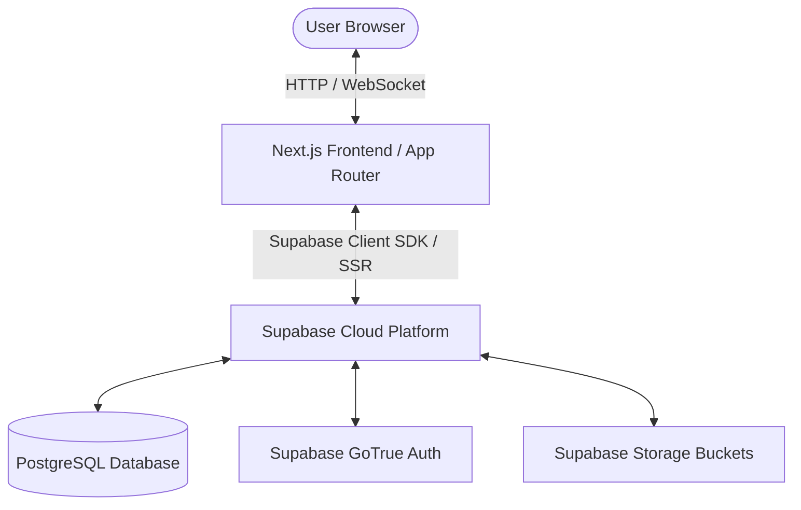
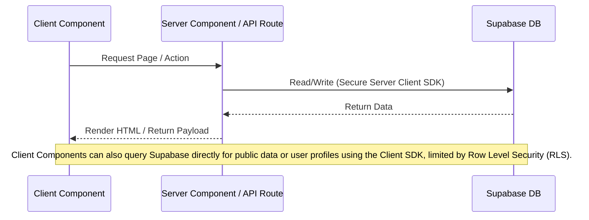

---
[AI] This document describes the system architecture of the EZPlay digital platform. It outlines the technology stack (Next.js 16, Supabase, TailwindCSS v4, shadcn/ui), folder organization (App Router, src/ directory), and explains how client-side and server-side components interact with Supabase client wrappers and API routes.
[HUMAN] This document is the master map of how the application is built behind the scenes. It explains what technologies we used, where all the files are located, and how the different parts of the website talk to each other.
---

# Technical Architecture — EZPlay

## 1. System Overview

EZPlay is designed as a modern web application leveraging a serverless architecture.

*   **Frontend**: Next.js 16 with React 19, TypeScript, and TailwindCSS v4.
*   **Backend as a Service (BaaS)**: Supabase (handling Auth, PostgreSQL database, Storage, and Realtime communication).
*   **Deployment**: Vercel.

---

## 2. Technology Stack Justification

*   **Next.js 16 (App Router)**: Offers hybrid rendering (Server-Side Rendering, Static Site Generation, Client-Side Rendering), native performance optimization, and excellent developer experience with TypeScript.
*   **Supabase**: Eliminates the need for a separate custom Node.js backend. Provides native integration with PostgreSQL, built-in Authentication (Email + OAuth), secure Row Level Security (RLS) policies, and serverless triggers.
*   **TailwindCSS v4**: Next-generation CSS framework. Extremely fast compilation, built-in support for css variables, and native dark mode variants out-of-the-box.
*   **shadcn/ui**: Component library built on Radix UI and TailwindCSS. It generates components directly into the codebase (`components/ui`), allowing full customization and avoiding bulky npm dependency packages.

---

## 3. Data Flow and Component Separation

Next.js App Router enforces a clean distinction between Server Components and Client Components:

### Server Components
*   Used for initial page rendering, dashboard statistics, metadata, and database reads.
*   Instantiated using `await createClient()` from `@/lib/supabase/server`.
*   Directly read cookies to authenticate session tokens safely.

### Client Components
*   Used for interactive elements: forms (Login, Register), interactive motherboard chips, onboarding wizard slides, charts (Skill Radar Chart), and toggles (language, theme).
*   Instantiated using `createClient()` from `@/lib/supabase/client`.
*   Marked with `"use client"` at the top of the file.

---

## 4. Key Directory Structure

*   `src/app/`: Contains the App Router routing structure.
    *   `(public)`: Public pages (Landing, About, How it Works).
    *   `(auth)`: Authorization pages (Login, Register, Onboarding).
    *   `(dashboard)`: Logged-in experience (Sidebar, Home, Profile, Settings).
    *   `(admin)`: Role-restricted admin panel pages.
    *   `api/auth/callback`: OAuth callback route for Google login.
*   `src/components/`: Reusable components.
    *   `ui/`: Base components installed via shadcn/ui.
    *   `layout/`: Global layouts (Navbar, Sidebar, Theme/Language toggles).
    *   `landing/`, `auth/`, `profile/`, `admin/`: Component groups mapped to page features.
*   `src/lib/`: Custom business logic, helpers, and configurations.
    *   `supabase/`: DB Clients (`client.ts`, `server.ts`, `middleware.ts`) and database Types (`types.ts`).
    *   `i18n/`: Internationalization setups (`config.ts`, `get-dictionary.ts`) and dictionaries (`ro.json`, `en.json`).
