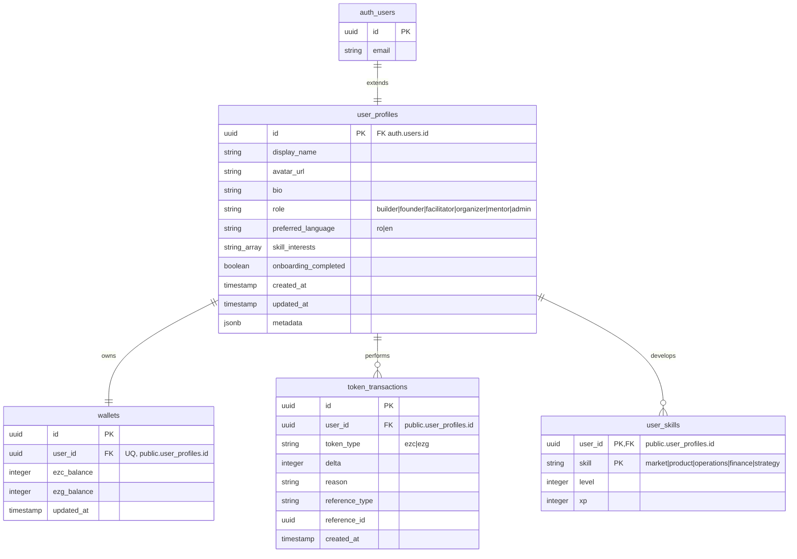

---
[AI] This document details the database schema implemented in Supabase (PostgreSQL). It lists the tables (user_profiles, wallets, token_transactions, user_skills), columns, data types, foreign keys, triggers (such as handling new auth.users insertion), and Row Level Security (RLS) policies.
[HUMAN] This document describes how the database is structured. It shows where we save user profiles, their token balances, transaction history, and skill progress, including the safety rules that prevent users from seeing each other's private data.
---

# Database Schema & Security — EZPlay

## 1. Relational Diagram

Here is how the Phase 1 database tables are structured and linked:



---

## 2. Table Schemas

### `public.user_profiles`
Extends the core Supabase authentication table `auth.users`. Holds profile metadata.

*   `id` (UUID, Primary Key): References `auth.users(id)` with cascade deletion.
*   `display_name` (TEXT, NOT NULL): The nickname shown in the app.
*   `avatar_url` (TEXT): Link to profile image (either gravatar, initials, or Supabase Storage file).
*   `bio` (TEXT): A short personal description.
*   `role` (TEXT, NOT NULL, DEFAULT 'builder'): Restrained by CHECK constraints to: `builder`, `founder`, `facilitator`, `organizer`, `mentor`, `admin`.
*   `preferred_language` (TEXT, DEFAULT 'ro'): Restrained to `ro`, `en`.
*   `skill_interests` (TEXT[], DEFAULT '{}'): List of perspectives selected during onboarding.
*   `onboarding_completed` (BOOLEAN, DEFAULT FALSE): Flag to control onboarding wizard redirection.
*   `created_at` / `updated_at` (TIMESTAMPTZ, DEFAULT NOW()).
*   `metadata` (JSONB, DEFAULT '{}'): Catch-all for extra settings.

### `public.wallets`
Tracks virtual game token balances (Coins - EZC, Gems - EZG).

*   `id` (UUID, Primary Key): Autogenerated.
*   `user_id` (UUID, Unique, NOT NULL): References `public.user_profiles(id)` with cascade deletion.
*   `ezc_balance` (INTEGER, DEFAULT 0, >= 0): Coins balance.
*   `ezg_balance` (INTEGER, DEFAULT 0, >= 0): Gems balance.
*   `updated_at` (TIMESTAMPTZ, DEFAULT NOW()).

### `public.token_transactions`
Ledger of token updates. Essential for data auditability.

*   `id` (UUID, Primary Key): Autogenerated.
*   `user_id` (UUID, NOT NULL): References `public.user_profiles(id)`.
*   `token_type` (TEXT, NOT NULL): `ezc` or `ezg`.
*   `delta` (INTEGER, NOT NULL): Positive or negative token change.
*   `reason` (TEXT, NOT NULL): Description of the transaction.
*   `reference_type` (TEXT): Type of linked resource (e.g., 'session', 'challenge').
*   `reference_id` (UUID): ID of the linked resource.
*   `created_at` (TIMESTAMPTZ, DEFAULT NOW()).

### `public.user_skills`
Tracks experience (XP) and level progress on the 5 entrepreneurship perspectives.

*   `user_id` (UUID, Primary Key): References `public.user_profiles(id)`.
*   `skill` (TEXT, Primary Key): `market`, `product`, `operations`, `finance`, or `strategy`.
*   `level` (INTEGER, DEFAULT 1, >= 1): Level of competence.
*   `xp` (INTEGER, DEFAULT 0, >= 0): Cumulative experience points.

---

## 3. Automated Triggers & Functions

### `public.handle_new_user()`
Runs automatically whenever a row is inserted into `auth.users` (sign-up).
1.  Extracts user meta data (such as Google OAuth avatar and name) or falls back to email prefix.
2.  Creates a matching row in `public.user_profiles`.
3.  Creates a matching row in `public.wallets` with 100 starter Coins (EZC).
4.  Seeds 5 base rows in `public.user_skills` (one for each of the 5 skills, starting at Level 1, XP 0).

```sql
CREATE OR REPLACE TRIGGER on_auth_user_created
  AFTER INSERT ON auth.users
  FOR EACH ROW EXECUTE FUNCTION public.handle_new_user();
```

---

## 4. Row Level Security (RLS) Policies

All database access is secured by default. The following rules are active:

*   **`user_profiles`**:
    *   *Select*: Open to all authenticated users (Public read user profiles).
    *   *Update*: Restricted to own profile (`auth.uid() = id`).
*   **`wallets`**:
    *   *Select*: Restricted to own wallet (`auth.uid() = user_id`).
*   **`token_transactions`**:
    *   *Select*: Restricted to own transactions (`auth.uid() = user_id`).
*   **`user_skills`**:
    *   *Select*: Open to all authenticated users (Public read user skills).
    *   *Update*: Restricted to own skills (`auth.uid() = user_id`).
